# TP2 – Kubernetes & Service Mesh (Linkerd)

Un système de suivi d'analyses médicales « LaboTrack » déployé sur Kubernetes (Minikube) avec Linkerd comme Service Mesh.

## Développeur
- Khalil MZOUGHI

## Sommaire

1. [Architecture](#architecture)
2. [Structure du projet](#structure-du-projet)
3. [Étape 1 – Questions Kubernetes](#étape-1--questions-kubernetes)
   - [Gestion de Minikube (Q1–Q12)](#gestion-de-minikube-q1q12)
   - [Gestion des pods et services (Q13–Q20)](#gestion-des-pods-et-services-q13q20)
4. [Étape 1 – Questions Docker Build](#étape-1--questions-docker-build)
5. [Étape 2 – LaboTrack (Service Mesh)](#étape-2--labotrack-service-mesh)
   - [Installation et déploiement](#installation-et-déploiement)
   - [Tests fonctionnels](#tests-fonctionnels)
   - [Linkerd – Observabilité et politiques](#linkerd--observabilité-et-politiques)
   - [Monitoring optionnel Prometheus / Grafana](#monitoring-optionnel-prometheus--grafana)
6. [Configuration](#configuration)

---

## Architecture

Namespace : `labotrack` (Linkerd injection activée)

**Communication inter-services :** `analysis-api → sample-api` via **gRPC** (port 9090) pour les transitions de statut et la récupération des données. Les appels client/frontend restent en REST HTTP.

**Cycle de vie d'un échantillon :**

```
POST /samples          POST /analyze/{id}                    GET /results/{id}
     │                       │                                      │
     ▼                       ▼  (gRPC interne)                      ▼
ENREGISTREMENT  →  PRÉ-ANALYSE  →  ANALYSE  →  VALIDATION  →  RESTITUTION
 (sample-api)     (PRE_ANALYSIS)  (IN_ANALYSIS) (VALIDATED)   (COMPLETED)
```

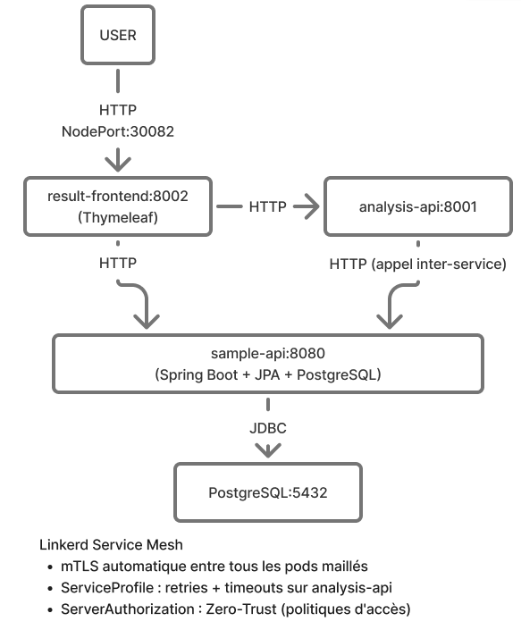

---

## Étape 1 – Questions Kubernetes

### Gestion de Minikube (Q1–Q12)

#### (1) Vérifier que Minikube pointe vers le moteur Docker

```bash
minikube config view
docker context ls
```

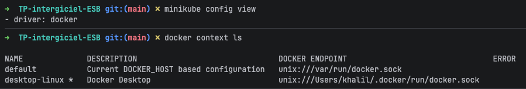

---

#### (2) Lister les addons installés

```bash
minikube addons list
```

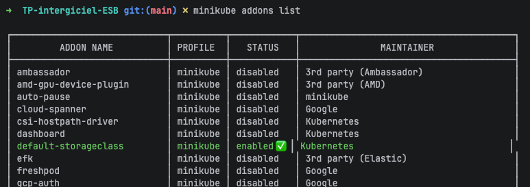

---

#### (3) Installer un addon intéressant

```bash
minikube addons enable metrics-server
minikube addons enable dashboard
minikube addons list | grep enabled
```

`metrics-server` est particulièrement utile car il permet d'utiliser `kubectl top pods` et `kubectl top nodes` pour surveiller la consommation CPU/mémoire en temps réel — indispensable pour diagnostiquer des problèmes de performance dans un cluster.

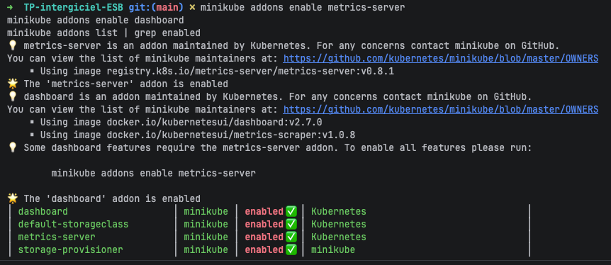

---

#### (4) Lister les profils avec toutes leurs caractéristiques

```bash
minikube profile list
```

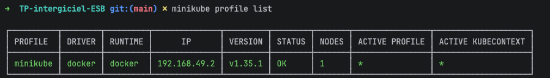

---

#### (5) Profils en cours

```bash
minikube profile
```

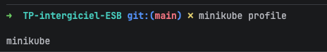

---

#### (6) Créer un nouveau profil

```bash
minikube start --profile test-profile --driver=docker --cpus=2 --memory=2048
minikube profile list
```

**Qu'est-ce qu'un profil ?** Un profil Minikube représente un cluster Kubernetes isolé avec sa propre VM/conteneur, sa propre configuration réseau, ses propres ressources (CPU, RAM) et sa propre version de Kubernetes. Il permet de faire tourner plusieurs clusters indépendants sur la même machine -> utile pour tester différentes versions ou configurations sans conflit.

```bash
# Supprimer le profil de test après démonstration
minikube delete --profile test-profile
```


---

#### (7) Afficher le statut de Minikube

```bash
minikube status
```

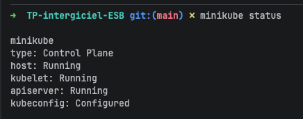

---

#### (8 & 9) Accéder au Dashboard – Qu'est-ce que le Dashboard ?

```bash
minikube dashboard
```

**Qu'est-ce que le Dashboard ?** Le Dashboard Kubernetes est une interface web graphique permettant de visualiser et gérer les ressources du cluster : pods, deployments, services, namespaces, ConfigMaps, secrets, PVC, et événements. Il affiche les métriques CPU/mémoire (si metrics-server est actif), les logs des conteneurs, et permet des actions CRUD directement depuis le navigateur sans passer par `kubectl`.

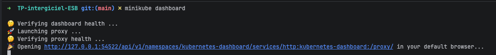

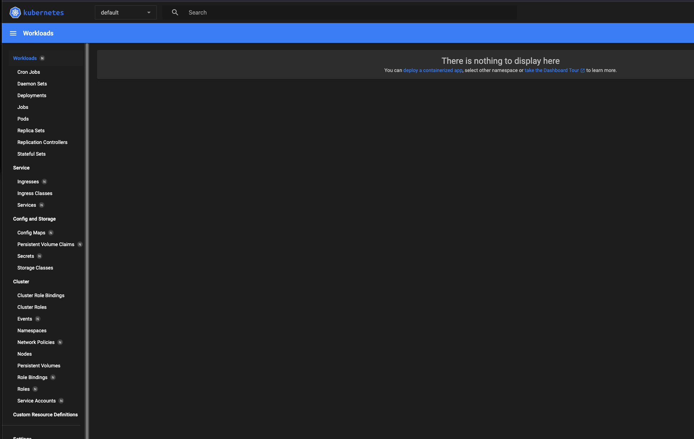

---

#### (10) Lister les nœuds d'un profil

```bash
kubectl get nodes -o wide
```

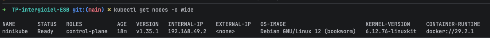

---

#### (11) Ajouter puis supprimer un nœud

```bash
# Ajouter un nœud worker
minikube node add --worker

# Vérifier les nœuds (2 maintenant)
kubectl get nodes

# Supprimer le nœud ajouté (remplacer <nom> par le nom affiché, ex: minikube-m02)
minikube node delete minikube-m02

# Vérifier (1 nœud de nouveau)
kubectl get nodes
```
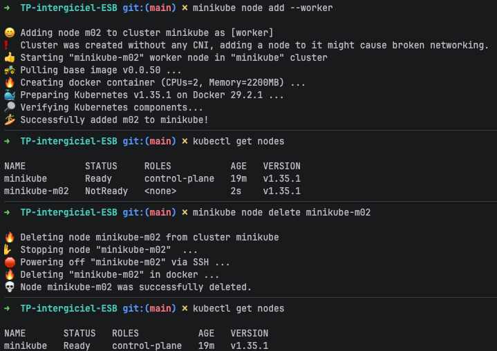

---

#### (12) Consulter les logs de Minikube

```bash
minikube logs | tail -30
```

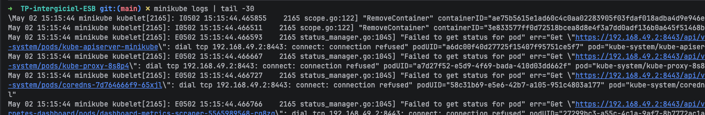

---

### Gestion des pods et services (Q13–Q20)

#### (13) Lister les images en cours d'exécution

```bash
eval $(minikube docker-env)
docker images
```

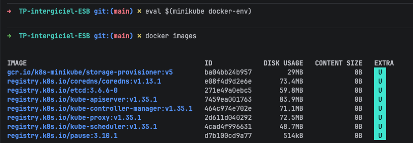

---

#### (14) Lancer nginx en mode impératif

```bash
kubectl create deployment nginx --image=nginx:alpine
kubectl get pods -w
# Attendre que STATUS = Running, puis Ctrl+C
kubectl get pods
```

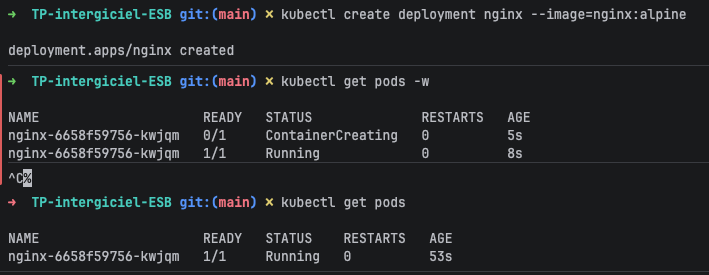

---

#### (15) Créer un service en mode impératif

```bash
kubectl expose deployment nginx --port=80 --type=NodePort
kubectl get service nginx
```


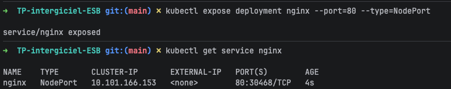

---

#### (16) Visualiser les informations du pod et du service

```bash
kubectl describe pod -l app=nginx
kubectl describe service nginx
```
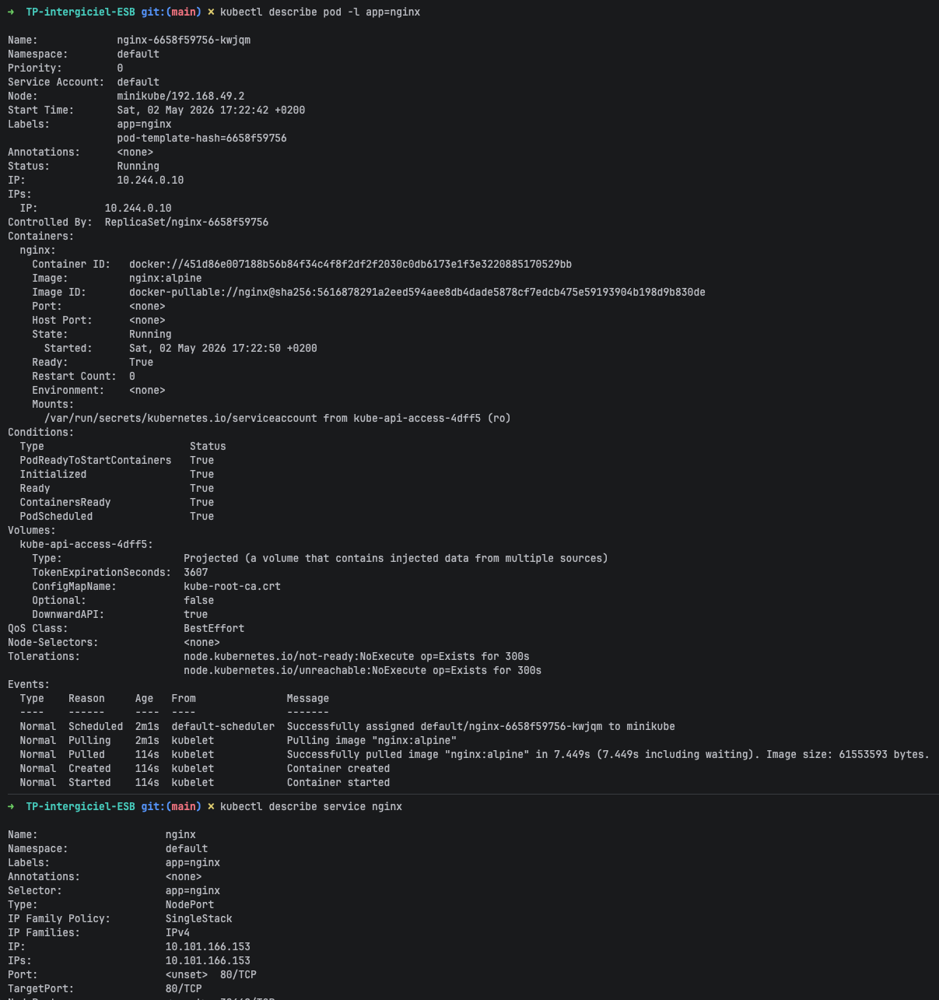

---

#### (17) Obtenir l'URL du service

```bash
minikube service nginx --url
```

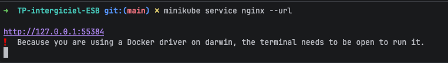

---

#### (18) Exécuter dans un navigateur

```bash
minikube service nginx
# Ouvre automatiquement le navigateur
```
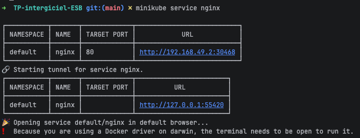

---

#### (19) Exécuter bash dans le conteneur nginx

```bash
POD=$(kubectl get pod -l app=nginx -o jsonpath='{.items[0].metadata.name}')
echo "Pod: $POD"
kubectl exec -it "$POD" -- /bin/sh
# Dans le shell du conteneur :
# hostname
# ls /etc/nginx/
# exit
```

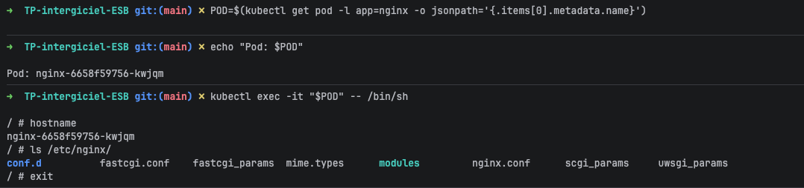

---

#### (20) Logs du conteneur nginx

```bash
POD=$(kubectl get pod -l app=nginx -o jsonpath='{.items[0].metadata.name}')
kubectl logs "$POD"
```

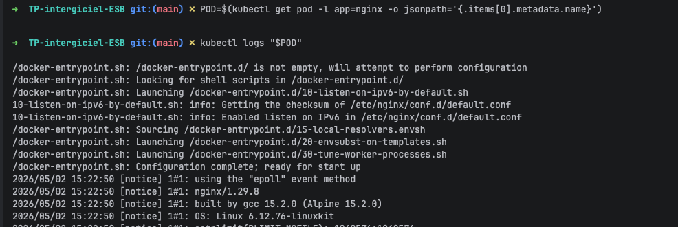

#### Arrêter Minikube (après les questions Q1–Q20)
```bash
minikube stop
```

---

## Étape 1 – Questions Docker Build

### Service démonstrateur (`demo-service`)

Le service expose :
- `GET /monservice/echo/{nom}` → écho du nom
- `POST /monservice/hello` avec body `{"nom": "value"}` → message de salutation

#### Test local sans conteneur

```bash
cd src/main/java/fr.insa.mesh/demo-service
mvn clean package -q
mvn spring-boot:run &
sleep 5

curl http://localhost:8080/monservice/echo/Khalil
curl -X POST http://localhost:8080/monservice/hello \
     -H "Content-Type: application/json" \
     -d '{"nom":"Khalil"}'
```

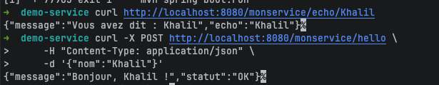

---

#### Cas 1 – Dockerfile fat-jar (compilation locale préalable)

```bash
cd src/main/java/fr.insa.mesh/demo-service
# Le fat-jar doit être déjà compilé (mvn package ci-dessus)
docker build -t demo-service:cas1 .
docker run -d -p 8080:8080 --name demo-cas1 demo-service:cas1
sleep 8

curl http://localhost:8080/monservice/echo/Khalil
curl -X POST http://localhost:8080/monservice/hello \
     -H "Content-Type: application/json" \
     -d '{"nom":"Khalil"}'

docker stop demo-cas1 && docker rm demo-cas1
```

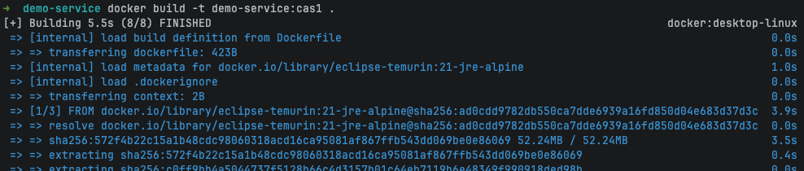

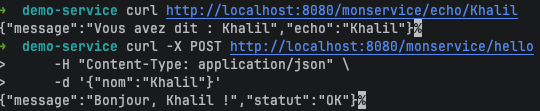

---

#### Cas 2 – Dockerfile Multi-Stage (sans compilation locale)

```bash
cd src/main/java/fr.insa.mesh/demo-service
# Aucune compilation locale requise — tout se passe dans Docker
docker build -t demo-service:cas2 -f Dockerfile.multistage .
```

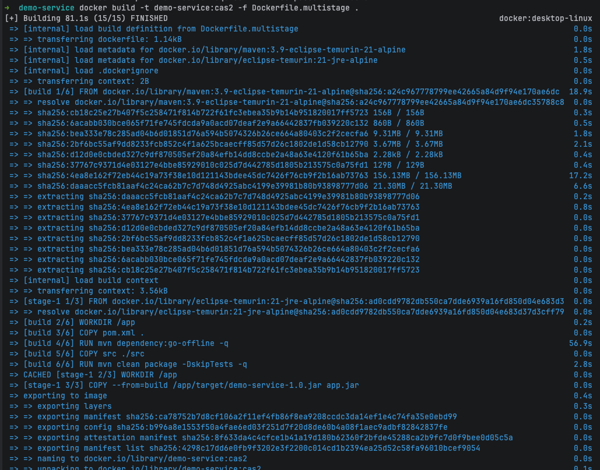

```bash
# Déploiement via docker-compose
docker compose up -d
sleep 10

curl http://localhost:8080/monservice/echo/Khalil
curl -X POST http://localhost:8080/monservice/hello \
     -H "Content-Type: application/json" \
     -d '{"nom":"Khalil"}'

docker compose down
```

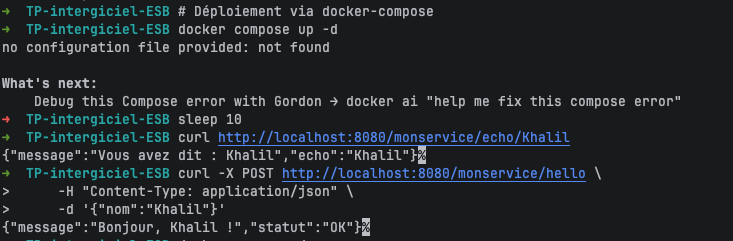

**Comparaison tailles d'images :**
```bash
docker images | grep demo-service
```

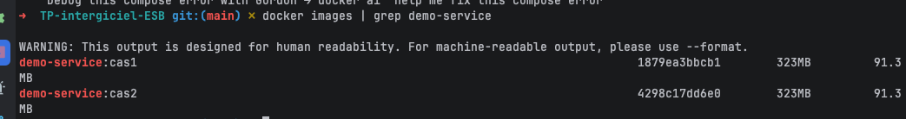

**Intérêt du build multi-stage :**
- L'image finale ne contient **ni JDK, ni Maven, ni code source** -> uniquement le JRE et le jar compilé.
- Taille d'image typiquement réduite de ~600 Mo à ~150 Mo (visible sur la capture ci-dessus).
- Aucune installation d'outils de buil sur la machine hôte requise.
- Séparation build / runtime : meilleure sécurité, surface d'attaque réduite.
- Reproductibilité : la même version de Maven et JDK est toujours utilisée, quelle que soit la machine.

---

## Étape 2 – LaboTrack (Service Mesh)

### Description des microservices

| Service | Port | Rôle | Technologies |
|---------|------|------|--------------|
| `sample-api` | 8080 | Réception & enregisatence 300 ms simulée) | Spring Boot 3.3, RestClient |
| `result-frontend` | 8082 | Tableau de bord HTML | Spring Boot 3.3, Thymeleaf |

### Endpoints REST

**sample-api :**
```
POST   /samples              → Enregistre un échantillon → {id, status: REGISTERED, ...}
GET    /samples/{id}         → État actuel d'un échantillon
GET    /samples              → Liste tous les échantillons
PATCH  /samples/{id}/status  → Met à jour le statut
```

**analysis-api :**
```
POST  /analyze/{id}   → Lance l'analyse (appel inter-service → sample-api, 300 ms de latence)
GET   /results/{id}   → Résultat d'une analyse effectuée
```

**result-frontend :**
```
GET   /                      → Page HTML avec liste + résultats
POST  /samples/create        → Formulaire de création
POST  /samples/{id}/analyze  → Déclenche une analyse
```

---

### Installation et déploiement

#### Prérequis
- Docker Desktop
- Minikube ≥ 1.32
- kubectl ≥ 1.28
- curl

#### Option 1 – RunBook automatisé (recommandé)

```bash
cd src/main/java/fr.insa.mesh
chmod +x runbook.sh
./runbook.sh          # Déploiement complet étapes 1→7
```

Autres commandes disponibles :
```bash
./runbook.sh build       # Build images uniquement
./runbook.sh deploy      # Déploiement k8s uniquement (après build)
./runbook.sh status      # État du cluster
./runbook.sh dashboard   # Ouvre les dashboards
./runbook.sh test        # Smoke tests
./runbook.sh monitoring  # Déploie Prometheus + Grafana (optionnel)
./runbook.sh clean       # Suppression complète
```

#### Option 2 – Déploiement manuel étape par étape

##### Étape 1 – Préparer Minikube

```bash
minikube start --driver=docker --cpus=4 --memory=6144
minikube addons enable metrics-server
minikube addons enable dashboard
eval $(minikube docker-env)
```

##### Étape 2 – Installer le CLI Linkerd + pré-checks

```bash
curl --proto '=https' --tlsv1.2 -sSfL https://run.linkerd.io/install | sh
export PATH="$HOME/.linkerd2/bin:$PATH"
linkerd version --client
linkerd check --pre
```
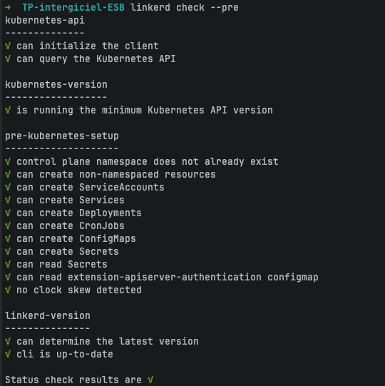

##### Étape 3 – Installer Linkerd (CRDs + control plane)

```bash
linkerd install --crds | kubectl apply -f -
linkerd install --set proxyInit.runAsRoot=true | kubectl apply -f -
linkerd check
linkerd viz install | kubectl apply -f -
kubectl rollout status deploy -n linkerd-viz --timeout=120s
```

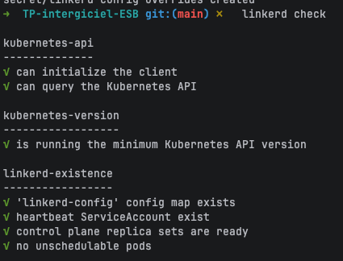

##### Étape 4 – Build des images et déploiement (app maillée)

```bash
eval $(minikube docker-env)

docker build -t labotrack/sample-api:1.0      src/main/java/fr.insa.mesh/sample-api/
docker build -t labotrack/analysis-api:1.0    src/main/java/fr.insa.mesh/analysis-api/
docker build -t labotrack/result-frontend:1.0 src/main/java/fr.insa.mesh/result-frontend/

docker images | grep labotrack
```

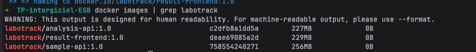

```bash
kubectl apply -f src/main/java/fr.insa.mesh/k8s/00-namespace.yaml
kubectl apply -f src/main/java/fr.insa.mesh/k8s/01-postgres.yaml
kubectl apply -f src/main/java/fr.insa.mesh/k8s/02-sample-api.yaml
kubectl apply -f src/main/java/fr.insa.mesh/k8s/03-analysis-api.yaml
kubectl apply -f src/main/java/fr.insa.mesh/k8s/04-result-frontend.yaml

kubectl wait --for=condition=ready pod --all -n labotrack --timeout=180s
kubectl get pods -n labotrack
```

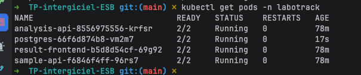

##### Étape 5 – Profils et politiques Linkerd

```bash
kubectl apply -f src/main/java/fr.insa.mesh/k8s/05-linkerd-profiles.yaml
kubectl apply -f src/main/java/fr.insa.mesh/k8s/06-policies.yaml
linkerd check
```

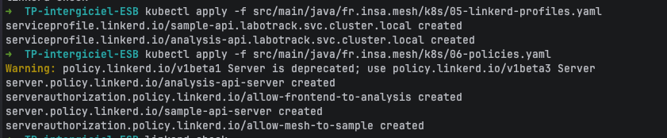

---

### Tests fonctionnels

> Sur macOS avec Docker driver, utiliser `kubectl port-forward` à la place de `minikube service --url` :
> ```bash
> kubectl port-forward svc/sample-api -n labotrack 8080:8080 &
> kubectl port-forward svc/analysis-api -n labotrack 8081:8081 &
> ```

```bash
SAMPLE_URL="http://localhost:8080"
ANALYSIS_URL="http://localhost:8081"

# 1. Enregistrement — crée l'échantillon (status: REGISTERED)
curl -s -X POST "$SAMPLE_URL/samples" \
  -H "Content-Type: application/json" \
  -d '{"patientName":"Marie Dupont","examType":"Glycémie","sampleType":"Sang"}' | python3 -m json.tool

# 2. Consulter l'échantillon (remplacer A1B2C3D4 par l'ID retourné)
curl -s "$SAMPLE_URL/samples/A1B2C3D4" | python3 -m json.tool

# 3. Lancer l'analyse — déclenche via gRPC : PRE_ANALYSIS → IN_ANALYSIS → VALIDATED → COMPLETED
curl -s -X POST "$ANALYSIS_URL/analyze/A1B2C3D4" | python3 -m json.tool

# 4. Restitution — récupérer le résultat final
curl -s "$ANALYSIS_URL/results/A1B2C3D4" | python3 -m json.tool
```

> **Flux gRPC interne :** lors de l'appel `POST /analyze/{id}`, `analysis-api` contacte `sample-api` via gRPC (port 9090) pour récupérer les données et mettre à jour le statut à chaque étape du cycle de vie.

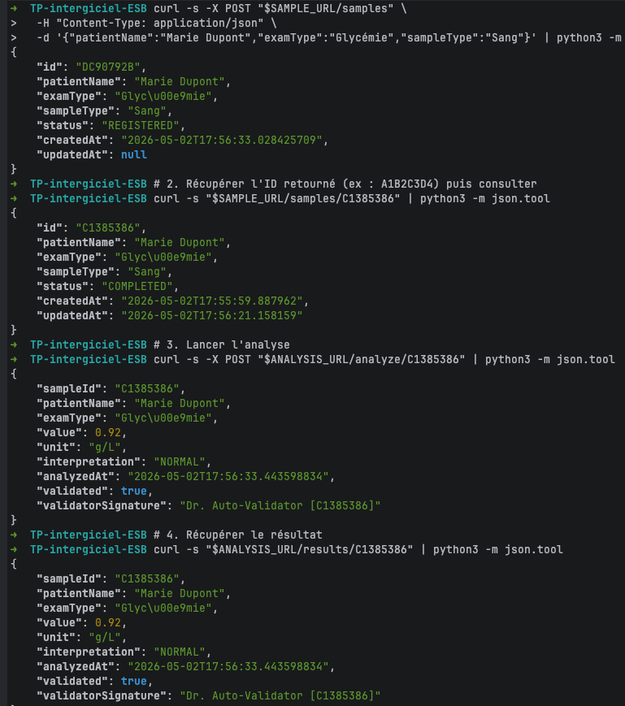

```bash
# Ouvrir l'interface web dans le navigateur
minikube service result-frontend -n labotrack
```
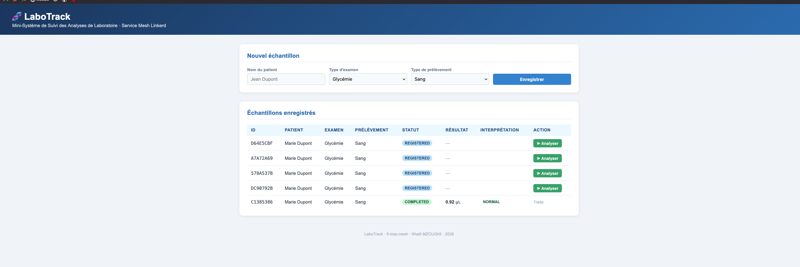

---

### Linkerd – Observabilité et politiques

#### Vérifier et diagnostiquer

```bash
# Statistiques de trafic par déploiement
linkerd viz stat deploy -n labotrack
```

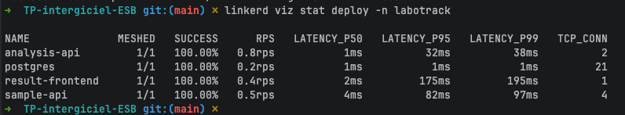

```bash
# Trafic en temps réel (top)
linkerd viz top deploy -n labotrack
# Laissez tourner 10-15 secondes pendant que vous envoyez des requêtes, puis Ctrl+C
```

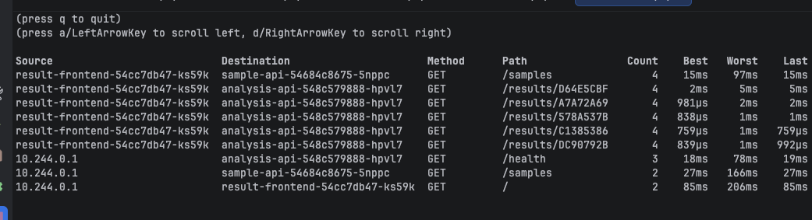

```bash
# Espionner le trafic inter-services (tap)
linkerd viz tap deploy/result-frontend -n labotrack --to deploy/analysis-api
# Déclenchez une analyse depuis l'interface web pendant que tap tourne, puis Ctrl+C
```
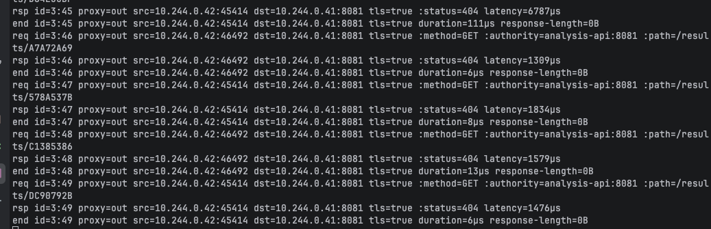

```bash
# Vérifier que mTLS est actif (arêtes du mesh)
linkerd viz edges pod -n labotrack
```

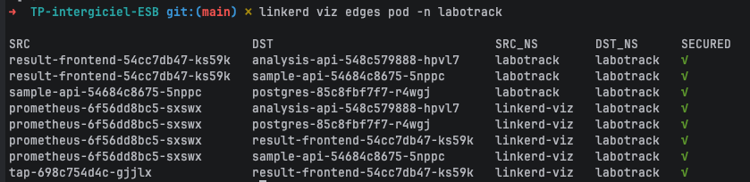

#### Dashboard Linkerd Viz

```bash
linkerd viz dashboard &
```

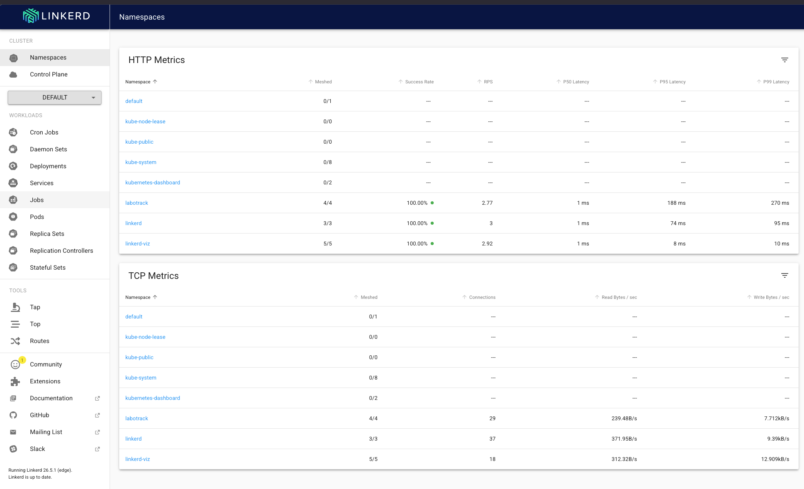

---

### Monitoring optionnel (Prometheus / Grafana)

```bash
kubectl apply -f src/main/java/fr.insa.mesh/k8s/07-prometheus-grafana.yaml
kubectl rollout status deployment/prometheus -n labotrack --timeout=120s
kubectl rollout status deployment/grafana -n labotrack --timeout=120s

echo "Grafana : http://$(minikube ip):30300  (admin / admin123)"
```

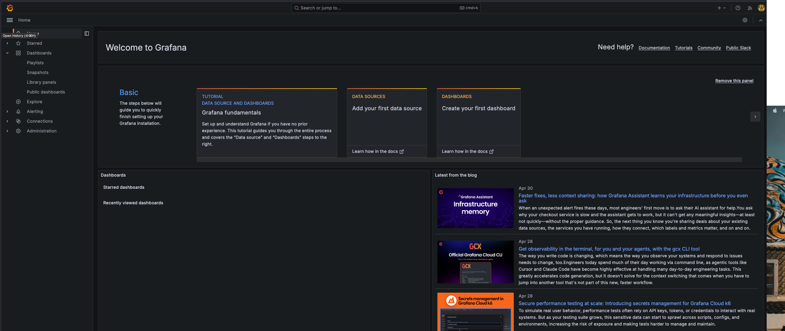

---

## Configuration

### Variables d'environnement

| Variable | Service | Défaut | Description |
|----------|---------|--------|-------------|
| `DB_URL` | sample-api | `jdbc:h2:mem:labotrack` | URL JDBC |
| `DB_USERNAME` | sample-api | `sa` | Utilisateur BDD |
| `DB_PASSWORD` | sample-api | _(vide)_ | Mot de passe BDD |
| `DB_DRIVER` | sample-api | `org.h2.Driver` | Driver JDBC |
| `GRPC_PORT` | sample-api | `9090` | Port serveur gRPC |
| `SAMPLE_API_GRPC_HOST` | analysis-api | `sample-api` | Host gRPC de sample-api |
| `SAMPLE_API_GRPC_PORT` | analysis-api | `9090` | Port gRPC de sample-api |
| `ANALYSIS_API_URL` | result-frontend | `http://localhost:8081` | URL de analysis-api |
| `ANALYSIS_DELAY_MS` | analysis-api | `300` | Latence simulée (ms) |